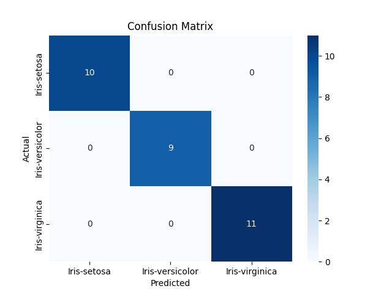

# 🌸 Task 01: Iris Flower Classification

This project is part of my Data Science Internship at **Oasis Infobyte** under the **AICTE OIB-SIP June 2025** cohort.

---

## 📌 Problem Statement

The goal is to classify iris flowers into one of three species – *Setosa*, *Versicolor*, or *Virginica* – based on four numeric features:  
- Sepal Length  
- Sepal Width  
- Petal Length  
- Petal Width

---

## 🛠️ Tech Stack & Libraries

- Python
- pandas, matplotlib, seaborn
- scikit-learn (KNN, LabelEncoder, StandardScaler, Train-Test-Split)
- Jupyter / Python Script

---

## 📁 Project Structure

```bash 
OIBSIP/
├── iris_classification.py
├── confusion_matrix.png
├── Data/
│ └── Iris.csv
└── README.md
```

---

## 🚀 Workflow

- Data Cleaning and Preprocessing
- Feature Scaling with `StandardScaler`
- Label Encoding species labels
- KNN Model training with `k=3`
- Accuracy and Evaluation using:
  - Classification Report
  - Confusion Matrix
  - Cross-Validation
- Prediction on a New Sample

---

## 📈 Results

- ✅ Model Accuracy: **100%** on test set
- ✅ Cross-validation Accuracy (avg): **96.67%**
- ✅ Confusion matrix saved as image
- ✅ Predicted new sample `[5.2, 3.4, 1.4, 0.2]` as **Iris-setosa**

---

## 📷 Demo Output



---

## 📌 Internship Info

- 🔸 Program: AICTE OIB-SIP June 2025  
- 🔸 Organization: Oasis Infobyte  
- 🔸 Domain: Data Science  
- 🔸 Mode: Remote  
- 🔸 Task #: 01 of 05

---

## 🔗 Connect

- 🔗 [LinkedIn Profile](https://www.linkedin.com/in/alireza-taheri-a34179164/)
- 🔗 #oasisinfobyte #datascience #knn #python #internship

